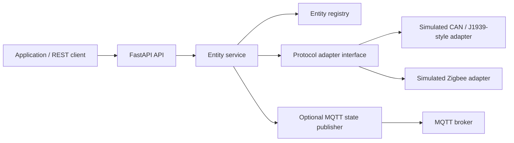

# Marine Entity Bridge — simulated Master thesis PoC


The central demonstration is **one API operation, two protocols**: `PUT /api/v1/entities/{entity_id}/light` with `{"on":true}` controls either simulated light by changing only the entity ID. A common entity model exposes protocol, address, capability, and current state. Two temperature sensors and one switch demonstrate read-only entities.



## Run locally

Python 3.11+ is required. From the project directory:

**Windows PowerShell**

```powershell
python -m venv .venv
.venv\Scripts\Activate.ps1
python -m pip install -e ".[test,mqtt]"
uvicorn bridge.api:app --host 127.0.0.1 --port 8000
```

If PowerShell blocks activation, run `.venv\Scripts\python.exe -m pip install -e ".[test,mqtt]"` and `.venv\Scripts\python.exe -m uvicorn bridge.api:app --host 127.0.0.1 --port 8000` instead.

**Linux/macOS**

```sh
python3 -m venv .venv
. .venv/bin/activate
python -m pip install -e '.[test,mqtt]'
uvicorn bridge.api:app --host 127.0.0.1 --port 8000
```

Open `http://127.0.0.1:8000/docs` for interactive API documentation. MQTT is disabled by default; the REST demo needs no broker.

## Same-command proof

Run either of these against the local server. The path and JSON body are identical; only the entity ID changes.

```sh
curl -X PUT http://127.0.0.1:8000/api/v1/entities/can-light-1/light -H "Content-Type: application/json" -d '{"on":true}'
curl -X PUT http://127.0.0.1:8000/api/v1/entities/zigbee-light-1/light -H "Content-Type: application/json" -d '{"on":true}'
curl http://127.0.0.1:8000/api/v1/entities
curl http://127.0.0.1:8000/health
```

PowerShell's `curl` may alias to another command. Use `curl.exe` with escaped JSON, or use:

```powershell
$body = @{ on = $true } | ConvertTo-Json
Invoke-RestMethod -Method Put -Uri http://127.0.0.1:8000/api/v1/entities/can-light-1/light -ContentType application/json -Body $body
Invoke-RestMethod -Method Put -Uri http://127.0.0.1:8000/api/v1/entities/zigbee-light-1/light -ContentType application/json -Body $body
```

Both return `state: {"on": true}`. The states live in memory and reset on restart. `GET /api/v1/entities/{id}` reads one entity. A light command to a temperature sensor returns HTTP 409, an unknown ID returns 404, and invalid input returns 422.

## Docker and MQTT

`docker compose up --build` starts the API and a Mosquitto broker for a **local development demo**. For a broker installed separately, set `BRIDGE_MQTT_ENABLED=true`, `BRIDGE_MQTT_HOST`, and `BRIDGE_MQTT_PORT` in `.env`. Successful commands publish retained QoS 1 JSON to `marine-bridge/entities/{id}/state`. Commands still travel through REST, not MQTT. No MQTT subscriptions or hardware telemetry ingestion are implemented.

This Mosquitto config allows anonymous access for local development. Do not expose it on an untrusted network. Production deployment would need authentication, TLS, topic ACLs, authorization on the REST API, and durable state handling.

## Tests

```sh
python -m pytest -q
```

Tests verify the same API command routes to both simulated adapters, state readback, emitted events, capability checks, input errors, and instance isolation.

## Extending to hardware

Implement `ProtocolAdapter.read` and `ProtocolAdapter.set_light` in `bridge/adapters.py`, then bind a new adapter in `make_adapters`. A real CAN/J1939 or NMEA 2000 integration would need explicit PGN/SPN mappings, transport and address management, bus access control, and electrical/test-bench validation. A real Zigbee integration would need device pairing, endpoint/cluster mapping, security keys, retries, and asynchronous state reconciliation. BLE and Matter could use the same interface, but are not implemented or simulated here. Replace the static registry with discovery/configuration and persistence for real deployments.
